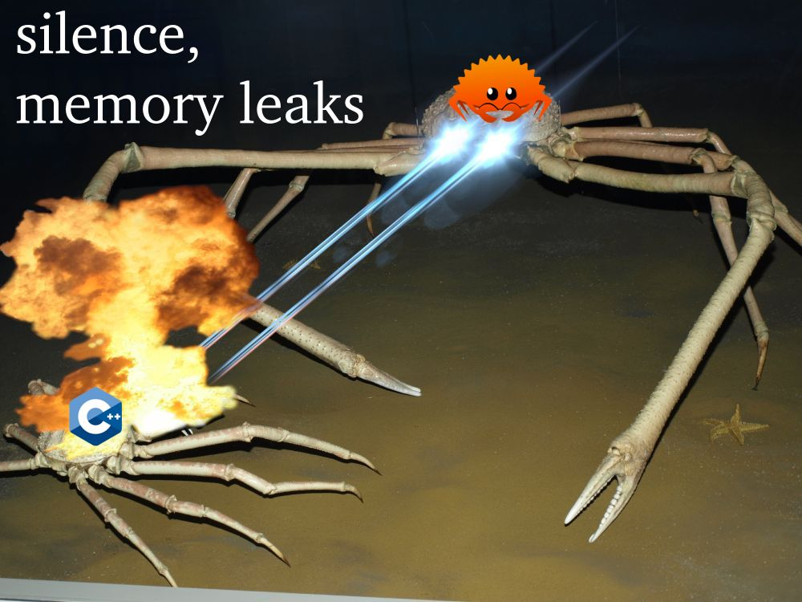

# 415pr1
Placeholder repository for CENG415's project. </br>
https://github.com/He-Is-HaZaRdOuS/rt-rs

# About
The aim of this project is to build a simple ray tracer from the ground up.

# How?
fn main() { trace_rays(); } /s

# Why Rust?


# Usage

### #1 Install the Rust build system (Cargo)
https://doc.rust-lang.org/cargo/getting-started/installation.html

### #2 Clone this repository
```
git clone https://github.com/He-Is-HaZaRdOuS/rt-rs.git
```
or just download as a zip and extract it

### #3 Run the program
```
cd rt-rs && cargo run --release
```

